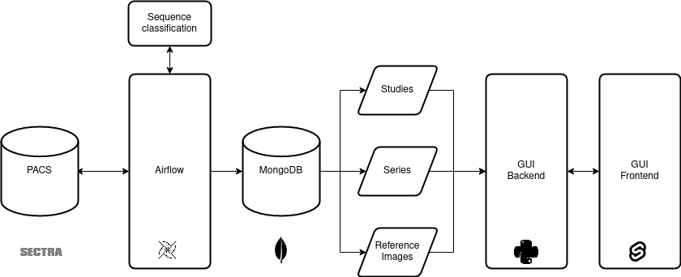

#### Overview

The `pacs-db` tool is developed within the [Stroke Research Center Bern](http://www.stroke.unibe.ch/) to extract and 
annotate large-scale imaging data from the clinical Picture Archive and Communication (PACS) system. Ultimately, the 
tool allows an automated creation or annotation of imaging-based clinical studies. 

The tool uses [Apache Airflow](https://airflow.apache.org/) to conduct and monitor the data transfer. In addition, 
filters ensure that only stroke-related studies are transferred. The web-based user-interface can be used to monitor 
the transfer and examine the tests results interactively (if manual annotations are 
available).

The machine learning module is used to predict the type of the sequence, e.g., SWI, DWI 
or ADC (see the [README](sequence-classification/README.md) for details). 

A further important feature is the categorization of the acquisition time, i.e., Internal 1 for the admission imaging 
and Internal x for follow-up examination. 

**Due to its modular design, `pacs-db` can be adapted to other medical areas:**



#### Create Docker stack 
  - `docker build -f airflow/Dockerfile -t pacs-airflow .`
  - `docker build -f gui-backend/Dockerfile -t gui-backend .`
  - `docker build -f gui-frontend/Dockerfile -t gui-frontend .`
  - `docker build -f sequence-classification/Dockerfile -t sequence-classification .`
  - `docker-compose up -d`

#### Credentials

Please update the `.env` file to reflect the configuration of your local PACS. Non-blank values
can be used as defaults.

#### MongoDB

The following collections must be present in the database MONGODB_DATABASE_NAME (see `.env`).

Lists of dict-formatted DICOMs:
  - `studies` 
  - `series`
  - `instances`, i.e., the actual images without PixelData. One reference image per series

Misc collections:
  - `swiss_stroke_registry` SSR cases including PatientID and admission time 
  - `tests` contains test results (automatic annotation vs. manual). If no manual collected data as reference is available, the tests will fail.
  - `errors` stores StudyInstanceUID and SeriesInstanceUID for failed PACS to database transfers.

#### Build Conda environment (for local development)
  - `conda env create -f .environment.yaml`
  - `conda activate pacs-db`

#### Execution
  
The transfer can be triggered by manually un-pausing a pipline in the [Airflow interface](http://localhost:8080) or 
by executing `python ./query_pacs.py`. See the 
[Airflow docs](https://airflow.apache.org/docs/apache-airflow/stable/index.html) for more information. `pacs-db` uses 
the PatientID and the admission time at hospital as reference. The information is parsed from the 
`swiss_stroke_registry` collection (see the example below). Other entries are optional.

```
{
    "PatientID": string,  
    "_SSRID": string,
    "arrival_time_at_hospital": date,
    "Lastname": null | string,
    "Firstname": null | string,
    "DOB": null | date,
    "First Internal Imaging Accession Number": null | string,
    "Second Internal Imaging Accession Number": null | string,
    "Doortoimagemin": null | int,
    "External Imaging Accession Number": null | string,
    "External Imaging Available": null | string,
    "External Imaging Date": null | string,
    "External Imaging Time": null | string,
    "First Internal Imaging Date": null | string,
    "First Internal Imaging Scanner": null | string,
    "First Internal Imaging Time": null | string,
    "Internal Acute Imaging available": null | string,
    "Second Internal Imaging Scanner": null | string,
    "Second Internal Imaging Time": null | string,
    "Second Internal Second Date": null | string,
    "Second acute internal imaging available": null | string
}
```

Note that the entries after DOB (date of birth) are required for the integration tests, however, are optional if no 
manually curated data is available.

#### Troubleshooting

We used the following Docker versions for development:

|                 | Version  |
|-----------------|----------|
| Docker          | 20.10.18 |
| Docker Compose  | 1.29.2   |

###### Logo sources:
  - [Sectra](https://sectraprodstorage01.blob.core.windows.net/medical-uploads/2017/09/sectra-logotype.png) (accessed October 2022)
  - [Airflow](https://icon-icons.com/icon/apache-airflow-logo/145494) (accessed October 2022)
  - [MongoDB](https://www.veryicon.com/icons/miscellaneous/gwidc_1/mongodb.html) (accessed October 2022)
  - [Python](https://icon-icons.com/nl/pictogram/python/68975) (accessed October 2022)
  - [Svelte](https://icon-icons.com/icon/svelte/213344) (accessed October 2022)
  