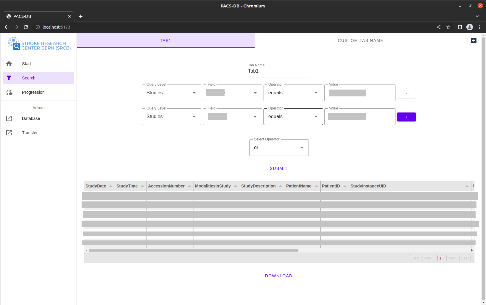
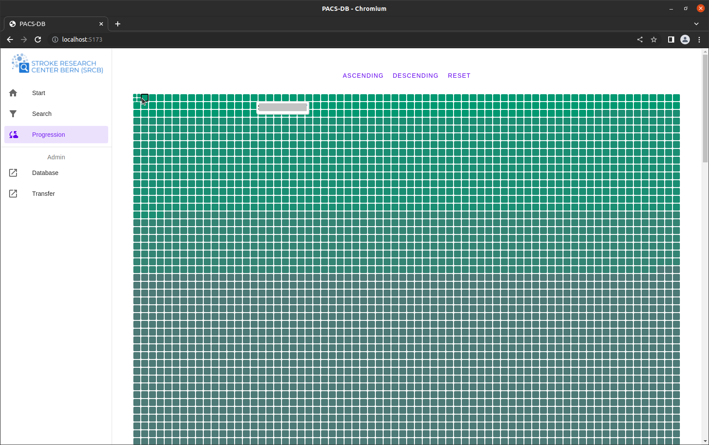
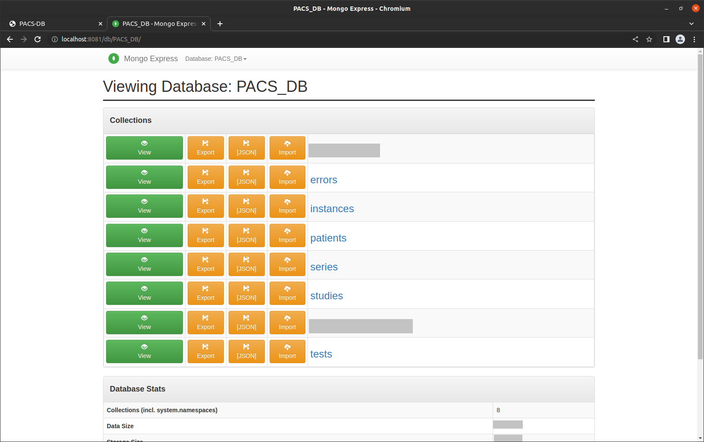
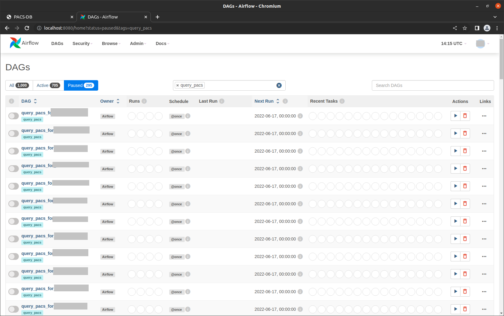

#### Search

This page allows to submit high-level queries to the underlying database. 

#### Progression

This page shows the progress of the data transfer as a heatmap. Cases waiting for transfer are depicted in lightgray 
(not shown). The number of successful tests is represented by darkgray to green rectangles. The greener the rectangle, 
the more tests passed. In this example, the rectangles are sorted by passed tests with descending order. The rectangles 
can be opened on click. The four sub-rectangles show the actual number of passed and failed tests. In this example all 
tests passed. At the end of the page more details for the present case (the open square) are provided (not shown). The 
default sort order is by ID (shown on the tooltip).  

#### Database

We also make use of mongo-express, a web-based tool to access the MongoDB. It allows the read-only access to the data,
which has been transferred from the PACS. More information abou mongo-express can be found at 
https://github.com/mongo-express/mongo-express.

#### Transfer

The Airflow user-interface can be seen on this page. It allows the supervision of the data transfer as well as the 
execution of numerous administration tasks (see also https://airflow.apache.org/docs/apache-airflow/2.3.2/ui.html).

