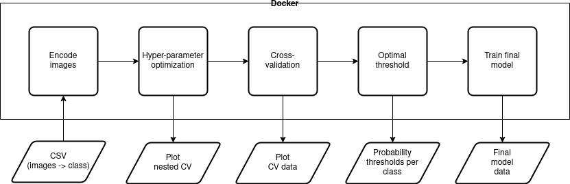
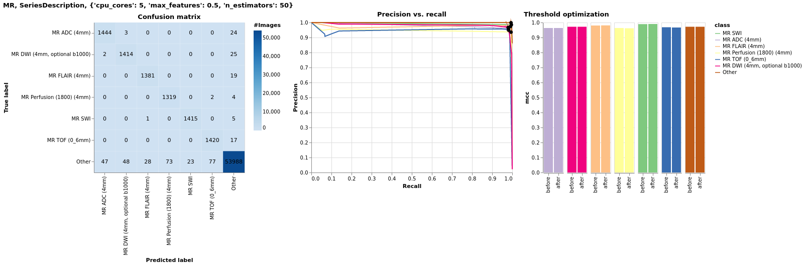
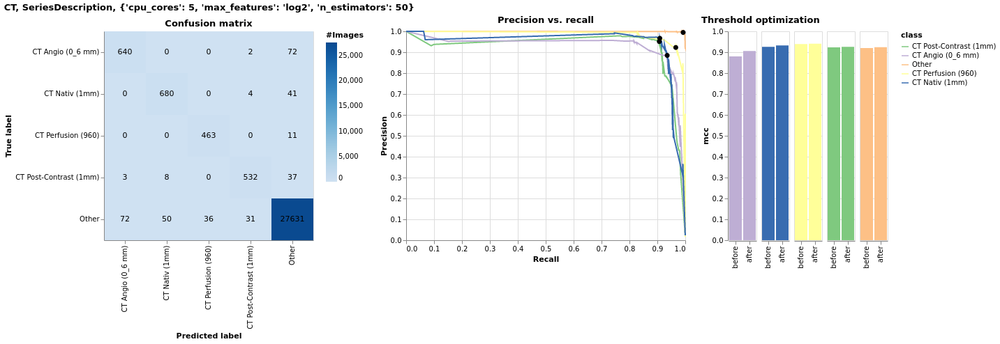

#### Overview

This folder contains the `sequence-classification` module. It is based on the work from 
[Gauriau _et al._ (2020)](https://doi.org/10.1007%2Fs10278-019-00308-x). The module runs in a Docker container. Train or
prediction queries can be submitted via the REST API (see `server.py`). 

Note that the model training requires reference images present in `SEQUENCE_CLASSIFICATION_REF_IMAGES_DIR` 
(see `.env` file in the parent directory). The folder corresponds to the following structure: 
`SEQUENCE_CLASSIFICATION_REF_IMAGES_DIR/Mod/Acc/SerUID/ImgUID`. Where `Mod` is the modality (MR or CT), `Acc` refers
to the AccessionNumber of the study, `SerUID` is the SeriesInstanceUID, and `ImgUID` is the SOPInstanceUID of the slice.



#### Create dataset(s) 
  - Download all studies: `python utils/download_studies.py` --> `data/accession_numbers.csv`
  - Get path of reference image: `python utils/parse_paths.py` --> `data/paths.csv`
  - Add classes: `python utils/add_classes.py` --> `data/{MR,CT}/paths_and_classes.csv`

#### Build Docker container 
  - Run `docker build -t sequence-classification .` in parent directory (see pacs-db README)

#### API documentation
  - http://localhost:7777/docs

#### Pre-processing and training

Execute the following command to encode the data, to run the hyper-parameter optimization, cross-validation, 
and get optimal threshold. Finally, the model will be trained and dumped in 
`data/{CT,MR}/{SeriesDescription,ProtocolName,Params}/`. See `tests/train_predict_api.py` for an example.

``` 
train_query = {
    "modality": "SeriesDescription" | "ProtocolName" | "Params",
    "tag": "CT" | "MR",
    "dataset": pandas.DataFrame.to_dict(orient="records"),
    "classes": classes
}
train_response = requests.post(
    "http://localhost:7777/train", json=train_query)
train_response = train_response.json()
```

#### Prediction

Execute the following command to predict unknown data. The input must be in the same shape as above. See 
`tests/train_predict_api.py` for an example.

``` 
predict_query = {
    "modality": "SeriesDescription" | "ProtocolName" | "Params",
    "tag": "CT" | "MR",
    "model_version": -1,  # use current model version
    "dataset": df_predict.to_dict(orient="records")}
predict_response = requests.post(
    "http://localhost:7777/predict", json=predict_query)
predict_response = predict_response.json()
```
  
#### Results

Visit http://localhost:7777/show to display the results of the hyper-parameter optimization, cross-validation, and 
the optimal threshold. Examples:





The online versions are interactive.

#### Build Conda environment (for local development)
  - `conda env create -f .environment.yaml`
  - `conda activate sequence-classification`
